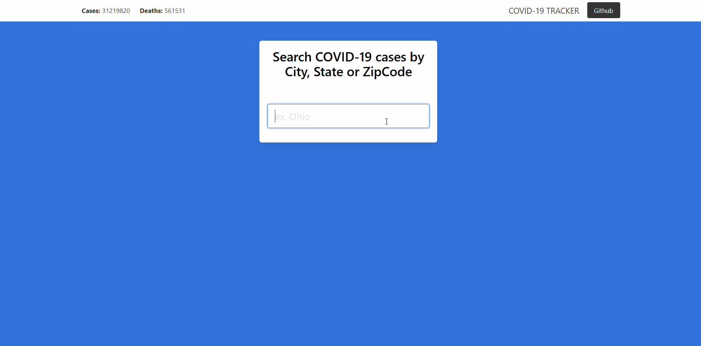

# COVID-19 TRACKER 

A simple web application that allows you to search Coronavirus (Covid-19) cases and deaths based on </br> 
[NY Times](https://github.com/nytimes/covid-19-data) open source data of Covid-19 cases on the state and county level. 


## Demo


<p align="center">
 
</p>

## Stack
Backend 
- [Flask](https://flask.palletsprojects.com/en/1.1.x/) - a micro web framework written in Python 
-  [Pandas](https://pandas.pydata.org/docs/getting_started/index.html)  - a software library written for the Python programming language for data manipulation and analysis
-  [SQLAlchemy](https://www.sqlalchemy.org/) - an open-source SQL toolkit and object-relational mapper for the Python programming

Font-End
- [React](https://reactjs.org/) - front end, JavaScript library for building user interfaces or UI components
-  [Next.js](https://nextjs.org/) - an open-source React front-end development web framework that enables functionality such as server-side rendering and generating static websites for React based web applications
-  [Bulma CSS](https://bulma.io/) - open source CSS framework based on Flexbox and built with Sass

## API
<p>The application API's were created using  [Flask](https://flask.palletsprojects.com/en/1.1.x/), a python web framework. </p>

### Available Routes 
<strong>/api/search</strong>
Takes in the selected search query by the user and searches the database for matches. Returns a pandas data frame as a json object. 
- @QueryParms 
	- any : UserInput = a search query entered by the user 
	- str : Type = type of search selected,  
```
Example: GET /api/search?search=Ohio&type=state
Returns: 
{
  columns: [ 'state', 'county', 'zip', 'cases', 'deaths', 'date' ],
  index: [
    24961, 29902, 29903, 29904, 29905, 29906, 29907,
    29908, 29909, 29910, 29911, 29912, 29913, 29914,
    29915, 29916, 29917, 29918, 29919, 29920, 29921,
  ],
  data: [
    [ 'Ohio', 'Ross', '39141', 6650, 145, 1618099200000 ],
    [ 'Ohio', 'Adams', '39001', 2262, 51, 1618099200000 ],
    [ 'Ohio', 'Allen', '39003', 11225, 229, 1618099200000 ],
    [ 'Ohio', 'Ashland', '39005', 4091, 86, 1618099200000 ],
    [ 'Ohio', 'Ashtabula', '39007', 6374, 163, 1618099200000 ],
    [ 'Ohio', 'Athens', '39009', 4948, 54, 1618099200000 ],
  ]
}
```

<strong>/api/filter</strong>
Takes a search query from the user and searches database for possible state,county and zip code matches. 
Returns a json object with States,County, Zipcode as keys with values as arrays.
- @QueryParms 
	- any : UserInput = a search query entered by the user 
```
Example: GET /api/filter?search=Ohio
Returns:
{
	"States": ["Ohio"], 
	"County": [["Indiana", "Ohio"], ["Kentucky", "Ohio"], ["West Virginia", "Ohio"]], 
	"Zipcode": []}
}
```

<strong>/api/nationalstats</strong>
Fetches the national case and death count for the United States and returns a json object.
```
Example: GET /api/nationalstats
Returns:
{ 
	TotalCases: 31219820, 
	TotalDeaths: 561531 
}
```


## Possible Improvements 

### Search 
* Incorporating some sort of fuzzy search to allow the user to find possible matches incase of spelling error or any other reason
* Include a search option to find locations by Zip Code

### Security 
 - Protect from SQL injections by creating stored procedures for each search option 
 -  Isolating the data for the national count of cases and deaths for the United States in the database
-  Creating token authentication for our API endpoints to only allow access from our application 


